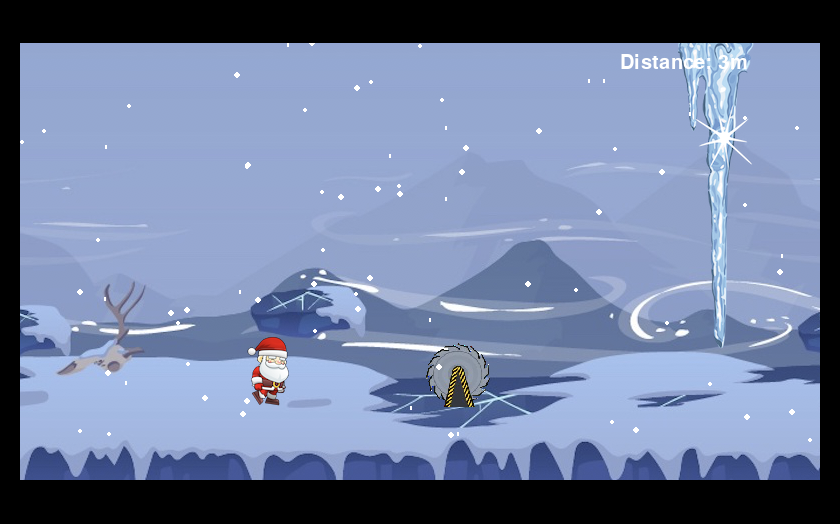

# Running Santa
This is a Christmas-themed game in python using the module [pygame](http://www.pygame.org/). In the game, we have a little Santa Claus running down the screen. There are obstacles appearing on the way and the Santa has to either jump over or slide under the obstacle. It continually gets faster, so as the time progresses it gets faster and therefore it gets more difficult to react.
# Setup
1. Before running the program, the pygame module need to be installed. How to install pygame: http://www.pygame.org/download.shtml
2. After installation of pygame, run `python main.py`. Then the game should run successfully.
3. use <kbd>↑</kbd> and </kbd>↓</kbd> key to play and </kbd>Esc</kbd> to close the game.
# Inspiration
The game was inspired by the “Hurdle Jump”:
* https://www.youtube.com/watch?v=FS7ji4FDRw0
* https://pastebin.com/JVQpfLfK
We learned how to use jump function from it.
# Contact
Created and modified by psxjz8@nottingham.ac.uk, psxcz7@nottingham.ac.uk, psxrb5@nottingham.ac.uk - feel free to contact us!
# Screenshot
